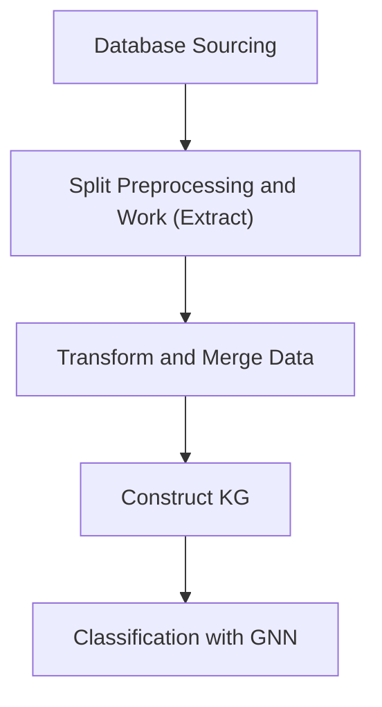

# Proteomic_Genomic_Cancer_KG
Develop a graph neural network to integrate proteomic and genomic features for cancer subtype classification (e.g. CPTAC-2 and CPTAC-3 breast, colorectal, and ovarian cancer data)

## Prototype Workflow

### Overview

### Methods
- Dataset Aggregation
  - 
- GNNs
  - [RSEA-MVGNN](https://github.com/junyu000/RSEA-MVGNN)

### Steps
1. Find or construct knowledge graphs relating both cancer genomics + proteomics data
  - Knowledge base from CPTAC data: https://kb.linkedomics.org/, link to paper: https://doi.org/10.1016/j.cels.2023.07.007
  - Cancer Cell Line Encyclopedia (not a KG) https://registry.opendata.aws/ccle/
  - CIVIC (Clinical Interpretation of Variants in Cancer) (not a KG) 4000 variants/400 diff cancers https://registry.opendata.aws/civic/
  - Multi-omics integration: Integration of large-scale multi-omic datasets: a protein-centric view - PMC
2. Add ontologies: StringDB / GO
3. With a KG (where nodes represent genes/variants), and edge index (what nodes are connected), pass to a simple graph convolutional network with a classification head -> final output: cancer subtype
4. Validation testing 
