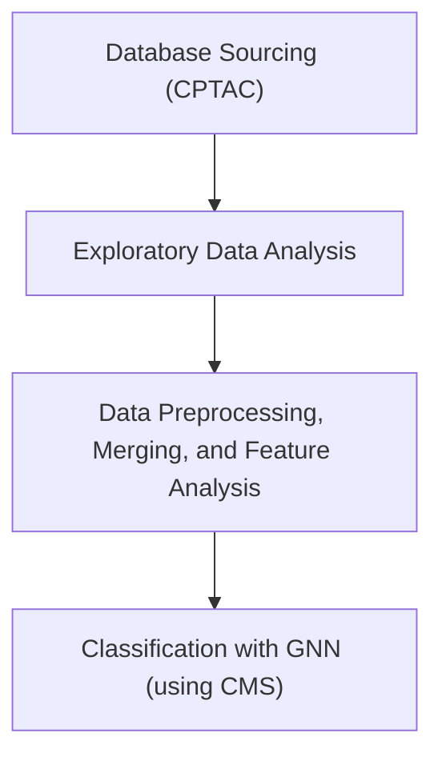

# ClassiGraph, a Colon Adenocarcinoma GNN Based Classifier

Develop a Graph Neural Network (GNN) to integrate proteomic and genomic features for cancer subtype classification (e.g. CPTAC-2 and CPTAC-3 breast, colorectal, and ovarian cancer data)

## Development Environment

1. Install [GithubDesktop](https://desktop.github.com/download/) or git.
2. Clone the repository
```
git clone https://github.com/collaborativebioinformatics/Proteomic_Genomic_Cancer_KG.git
cd Proteomic_Genomic_Cancer_KG
```
3. Install [anaconda](https://www.anaconda.com/download) or [mini-conda](https://www.anaconda.com/docs/getting-started/miniconda/install)
4. Create conda environment
```
conda create -n cptac-kgnn python==3.12
```
5. Install python dependencies
```
pip install -e .
```

## Methods

### Workflow
- **Patient anchor = proteomics + CMS labels. **Used tumor proteomics as the master list of samples and kept only those with CMS subtype → consistent cohort across all omics.
- **Phospho → gene aggregation (median). **Phospho comes at the site level; we collapse to one value per gene so it lines up with gene-level proteomics.
- **Feature filtering by missingness (tumor+normal). **Drop genes with poor coverage to reduce noise; keep all patients.
- **Within-modality KNN imputation. ** Filled remaining gaps per modality (proteo/phospho) to avoid discarding samples.
- **Baseline normalization using normals only.** For proteo/phospho, compute tumor z-scores against the normal cohort (no leakage from tumors).
- **Align proteo & phospho by gene union + masks.** Keep every gene present in either; carry a proteomics “was-missing” mask and a phospho “was-measured” mask; fill absent phospho with 0 after recording masks.
- **RNA & CNV compacting + train-only scaling.** Deduplicate, restrict to the intersection with protein genes (compact set), build availability masks, then z-score using train patients only and apply to val/test (leakage-safe).
- **Somatic mutations → sparse edges. ** Normalize gene IDs; for each patient record the indices of mutated proteins to form patient→protein “mutated” edges.
- **Labels & splits.** Map CMS to integers, drop ultra-rare classes, create stratified train/val/test splits.
- **Protein–protein graph (PPI). **Build a symmetric k-NN network from train patients only using co-expression similarity (optionally union with high-confidence STRING links restricted to measured proteins) to guide protein messaging.
- **Gene↔Protein identity links.** One-to-one “codes” edges connecting each gene node to its matching protein node.
- **Heterogeneous graph per patient.** Nodes: patient (1), protein (genes), gene (same set).
- **Protein features:** [proteo z, phospho z, proteo-missing mask].
- **Gene features: **[RNA z, CNV z, RNA avail., CNV avail.].
- **Edges: static PPI and gene↔protein**; patient↔protein mutation edges vary by patient.
- **Training setup.** Class-weighted loss, early stopping on macro-F1; (optional) feature-dropout augmentation and weighted sampling to stabilize small, imbalanced validation sets.

### Dataset Aggregation

  - [CPTAC COAD](https://www.cancerimagingarchive.net/collection/cptac-coad/) proteomic dataset (tumor + normal), somatic mutations, clinical subtype files using Consensus Molecular Subtypes (CMS) annotations.
  - Cleaning, filtering, and merging the data along with dropping the samples with not enough data.
  - Median imputation with missingness mask channel.

### Knowledge Graph Construction

#### Protein-Protein Interaction (PPI)


### GNNs

  - [GNNMutation](https://github.com/nozlemozcan/GNNMutation/blob/main/data/README.md) - heterogeneous graph-based framework for cancer detection (**training soon!**)
  - [MVGNN](https://github.com/uta-smile/CD-MVGNN) - for predicting cancer differentiation and subtype classification
  - [MoGCN](https://github.com/Lifoof/MoGCN) - a multi-omics integration model based on graph convolutional network (GCN) was developed for cancer subtype classification and analysis 

#### Training Basic GNN


### Literature Review

#### Knowledge Graphs

- [A knowledge graph to interpret clinical proteomics data](https://www.nature.com/articles/s41587-021-01145-6),
- [KG-Hub-building and exchanging biological knowledge graphs](https://pubmed.ncbi.nlm.nih.gov/37389415/)
- [Building a knowledge graph to enable precision medicine](https://www.nature.com/articles/s41597-023-01960-3)
- [Democratizing knowledge representation with BioCypher](https://www.nature.com/articles/s41587-023-01848-y)
  
#### Oncology
- [Validating Subtype Specific Oncology Drug Predictions](https://opendataknowl-b7u8178.slack.com/archives/C09HXSE7FAS/p1759341488941499)

### Next Steps?

- [Clinical Knowledge Graph (CKG)](https://ckg.readthedocs.io/en/latest/INTRO.html), HUGE resource for analysis of proteomics clinical data.
- [DisGeNET](https://disgenet.com/), relationships between diseases and human diseases
- DrugBank
- DrugCentral
- Entrez Gene
- MONDO disease ontology
- Rectome pathway database
- Side effects knowledgebase
- ...
- You get the idea! So many more data can be added to aid classification. LLMs can be used to help bridge the gap between terms (PrimeKG style), and even images (segmentation / obj. detection) can be integrated!

## Workflow
How we approached the problem.

### Overview



### Steps

1. Find or construct knowledge graphs relating both cancer genomics + proteomics data
  - Knowledge base from CPTAC data: https://kb.linkedomics.org/, link to paper: https://doi.org/10.1016/j.cels.2023.07.007
  - Cancer Cell Line Encyclopedia (not a KG) https://registry.opendata.aws/ccle/
  - CIVIC (Clinical Interpretation of Variants in Cancer) (not a KG) 4000 variants/400 diff cancers https://registry.opendata.aws/civic/
  - Multi-omics integration: Integration of large-scale multi-omic datasets: a protein-centric view - PMC
2. Add ontologies: StringDB / GO
3. With a KG (where nodes represent genes/variants), and edge index (what nodes are connected), pass to a simple graph convolutional network with a classification head -> final output: cancer subtype
4. Validation testing

### Progress of Working Pipeline

1) Download CPTAC COAD datasets (proteomics, mutations, clinical).
2) Clean, filter, and normalize proteomics data.
3) Convert to PyTorch tensors.
4) Align mutations to proteins/patients and build edge indices.
5) Load patient subtype labels.
6) Build heterogeneous PyG dataset (Patient ↔ Protein).
7) Split into train/val/test.
8) Define Heterogeneous GNN.
9) Train the model and evaluate predictions.
10) Save tensors, labels, and metadata for later use.
