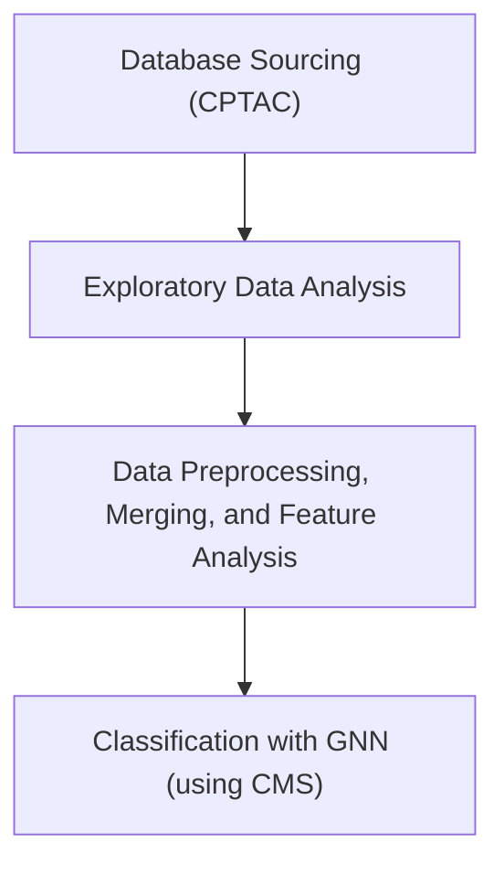

# Proteomic_Genomic_Cancer_KG
Develop a graph neural network to integrate proteomic and genomic features for cancer subtype classification (e.g. CPTAC-2 and CPTAC-3 breast, colorectal, and ovarian cancer data)

## Prototype Workflow

### Overview

### Methods

- Dataset Aggregation
  - CPTAC proteomics (tumor + normal), somatic mutations, clinical subtype files (CMS for colorectal).
  - Baseline normalization using normals as a reference to avoid leakage.
  - Cleaning and filtering by missingness thresholds.
  - Median imputation with missingness mask channel.
  
- GNNs
  - [MVGNN](https://github.com/uta-smile/CD-MVGNN) - for predicting cancer differentiation and subtype classification
  - [GNNMutation](https://github.com/nozlemozcan/GNNMutation/blob/main/data/README.md) - heterogeneous graph-based framework for cancer detection
  - [MoGCN](https://github.com/Lifoof/MoGCN) - a multi-omics integration model based on graph convolutional network (GCN) was developed for cancer subtype classification and analysis 
 

### Steps
1. Find or construct knowledge graphs relating both cancer genomics + proteomics data
  - Knowledge base from CPTAC data: https://kb.linkedomics.org/, link to paper: https://doi.org/10.1016/j.cels.2023.07.007
  - Cancer Cell Line Encyclopedia (not a KG) https://registry.opendata.aws/ccle/
  - CIVIC (Clinical Interpretation of Variants in Cancer) (not a KG) 4000 variants/400 diff cancers https://registry.opendata.aws/civic/
  - Multi-omics integration: Integration of large-scale multi-omic datasets: a protein-centric view - PMC
2. Add ontologies: StringDB / GO
3. With a KG (where nodes represent genes/variants), and edge index (what nodes are connected), pass to a simple graph convolutional network with a classification head -> final output: cancer subtype
4. Validation testing 

### Progress of Working Pipeline

1) Download CPTAC COAD datasets (proteomics, mutations, clinical).
2) Clean, filter, and normalize proteomics data.
3) Convert to PyTorch tensors.
4) Align mutations to proteins/patients and build edge indices.
5) Load patient subtype labels.
6) Build heterogeneous PyG dataset (Patient ↔ Protein).
7) Split into train/val/test.
8) Define Heterogeneous GNN.
9) Train the model and evaluate predictions.
10) Save tensors, labels, and metadata for later use.

### Graph Construction
  - Nodes: Protein nodes (with abundance features), Patient nodes (with optional clinical covariates).
  - Edges:
    - Patient ↔ Protein (mutation edges).
    - Protein ↔ Protein (STRING PPIs or co-expression).
