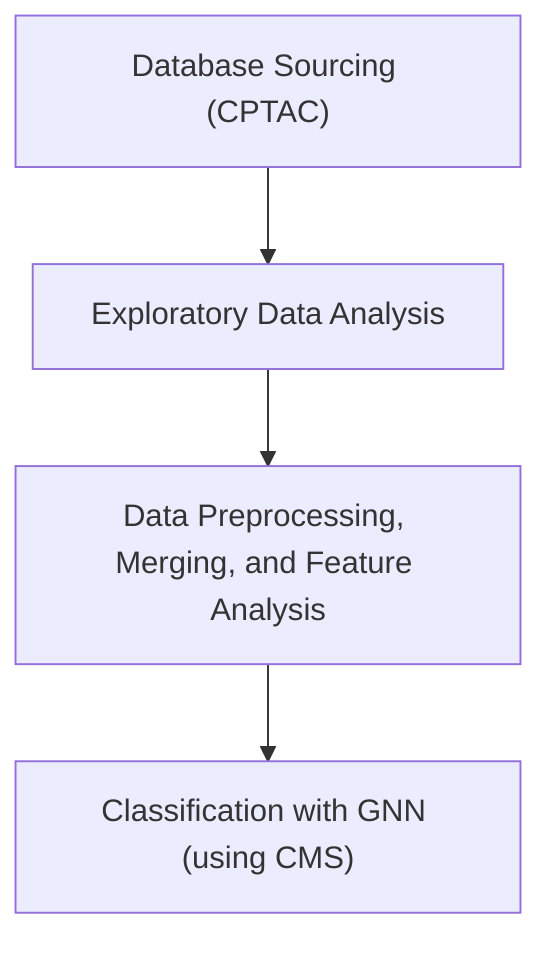

## Workflow
How we approached the problem.

### Overview

### Specific Preprocessing
- **Patient anchor = proteomics + CMS labels.** Used tumor proteomics as the master list of samples and kept only those with CMS subtype → consistent cohort across all omics.
- **Phospho → gene aggregation (median).** Phospho comes at the site level; we collapse to one value per gene so it lines up with gene-level proteomics.
- **Feature filtering by missingness (tumor+normal).** Drop genes with poor coverage to reduce noise; keep all patients.
- **Within-modality KNN imputation.** Filled remaining gaps per modality (proteo/phospho) to avoid discarding samples.
- **Baseline normalization using normals only.** For proteo/phospho, compute tumor z-scores against the normal cohort (no leakage from tumors).
- **Align proteo & phospho by gene union + masks.** Keep every gene present in either; carry a proteomics “was-missing” mask and a phospho “was-measured” mask; fill absent phospho with 0 after recording masks.
- **RNA & CNV compacting + train-only scaling.** Deduplicate, restrict to the intersection with protein genes (compact set), build availability masks, then z-score using train patients only and apply to val/test (leakage-safe).
- **Somatic mutations → sparse edges.** Normalize gene IDs; for each patient record the indices of mutated proteins to form patient→protein “mutated” edges.
- **Labels & splits.** Map CMS to integers, drop ultra-rare classes, create stratified train/val/test splits.
- **Protein–protein graph (PPI).** Build a symmetric k-NN network from train patients only using co-expression similarity (optionally union with high-confidence STRING links restricted to measured proteins) to guide protein messaging.
- **Gene↔Protein identity links.** One-to-one “codes” edges connecting each gene node to its matching protein node.
- **Heterogeneous graph per patient.** Nodes: patient (1), protein (genes), gene (same set).
- **Protein features:** [proteo z, phospho z, proteo-missing mask].
- **Gene features:** [RNA z, CNV z, RNA avail., CNV avail.].
- **Edges: static PPI and gene↔protein**; patient↔protein mutation edges vary by patient.
- **Training setup.** Class-weighted loss, early stopping on macro-F1; (optional) feature-dropout augmentation and weighted sampling to stabilize small, imbalanced validation sets.

### Steps

1. Find or construct knowledge graphs relating both cancer genomics + proteomics data
  - Knowledge base from CPTAC data: https://kb.linkedomics.org/, link to paper: https://doi.org/10.1016/j.cels.2023.07.007
  - Cancer Cell Line Encyclopedia (not a KG) https://registry.opendata.aws/ccle/
  - CIVIC (Clinical Interpretation of Variants in Cancer) (not a KG) 4000 variants/400 diff cancers https://registry.opendata.aws/civic/
  - Multi-omics integration: Integration of large-scale multi-omic datasets: a protein-centric view - PMC
2. Add ontologies: StringDB / GO
3. With a KG (where nodes represent genes/variants), and edge index (what nodes are connected), pass to a simple graph convolutional network with a classification head -> final output: cancer subtype
4. Validation testing

### Progress of Working Pipeline

1) Download CPTAC COAD datasets (proteomics, mutations, clinical).
2) Clean, filter, and normalize proteomics data.
3) Convert to PyTorch tensors.
4) Align mutations to proteins/patients and build edge indices.
5) Load patient subtype labels.
6) Build heterogeneous PyG dataset (Patient ↔ Protein).
7) Split into train/val/test.
8) Define Heterogeneous GNN.
9) Train the model and evaluate predictions.
10) Save tensors, labels, and metadata for later use.
